# Домашнее задание к занятию 4 «Оркестрация группой Docker контейнеров на примере Docker Compose»
# Ответы
## Задача 1

https://hub.docker.com/barsymey/custom-nginx/general

## Задача 2

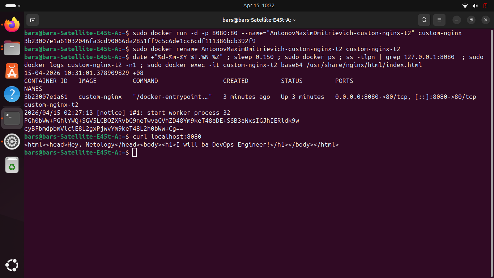

## Задача 3

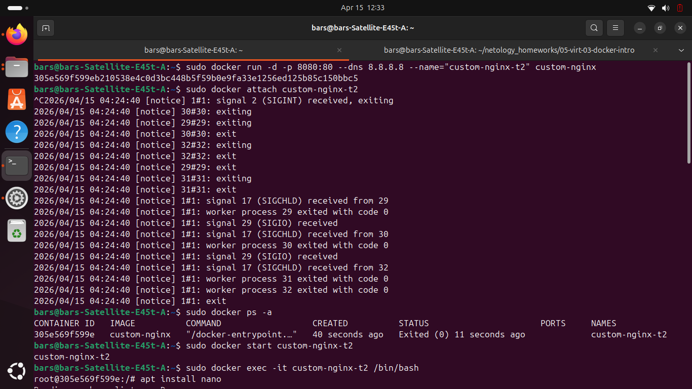
3. Контейнер остановился, так как основной процесс, поддерживающий его в запущеном состоянии, nginx, был остановлен.

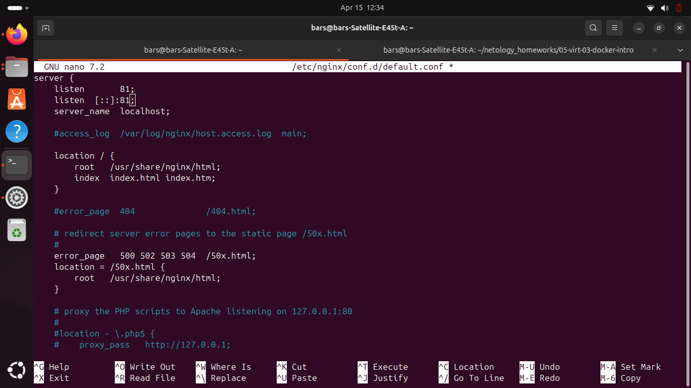
10. curl пытается получить данные с 80 порта. Так как порт nginx был переназначен на 81, с 80 ничего не приходит

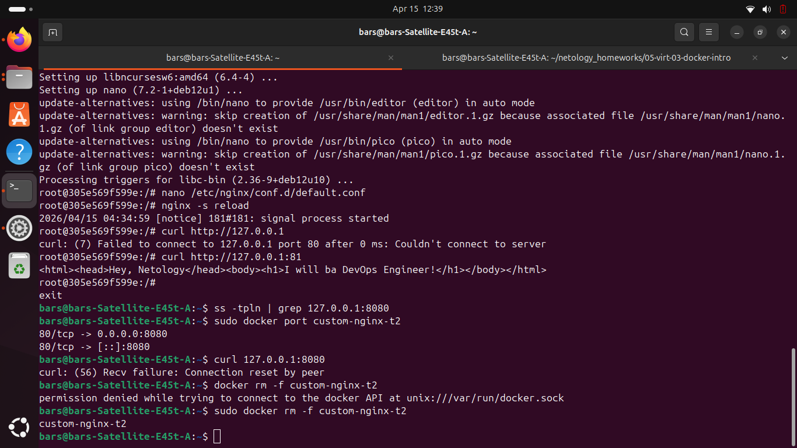

## Задача 4

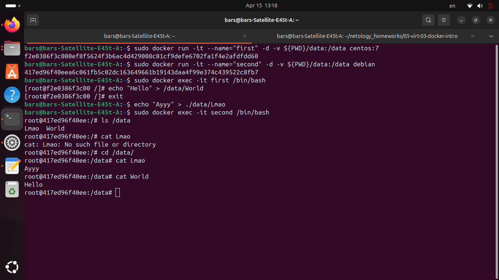

## Задача 5

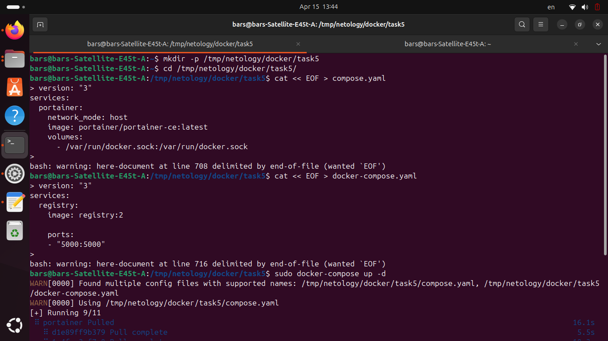

1. Судя по документации, Compose.yaml имеет приоритет.
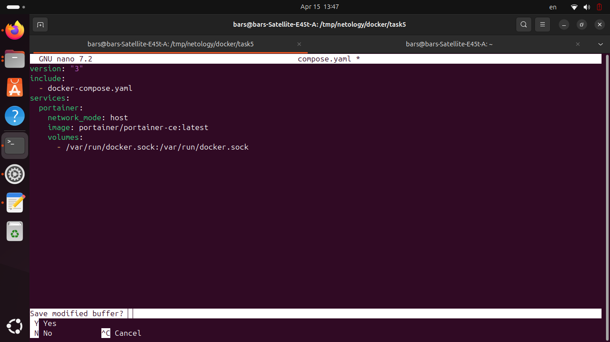
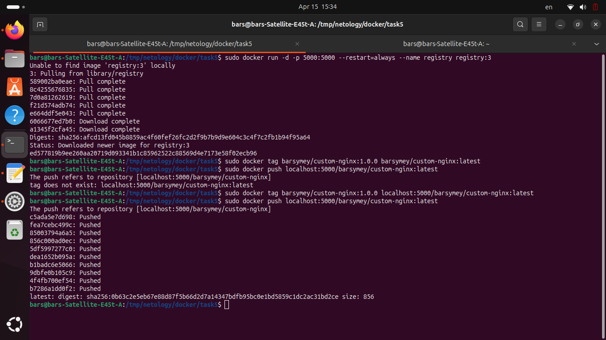
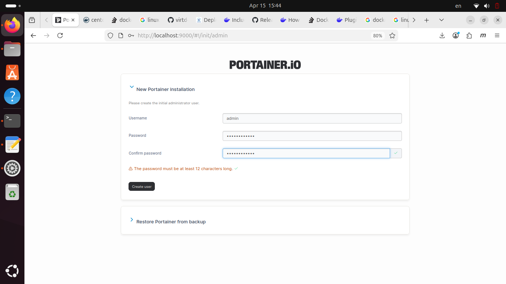
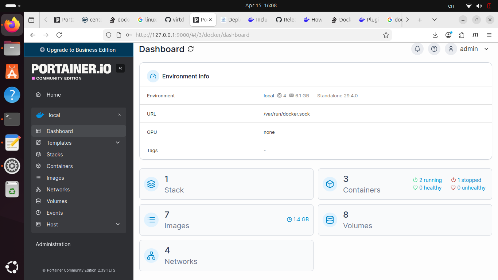
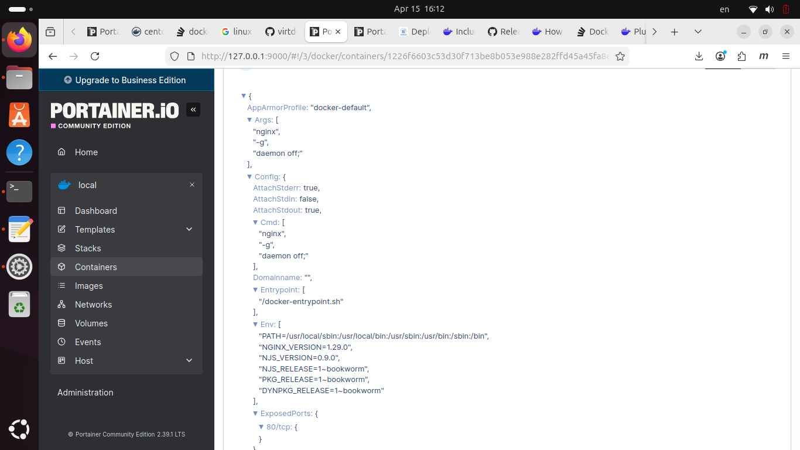
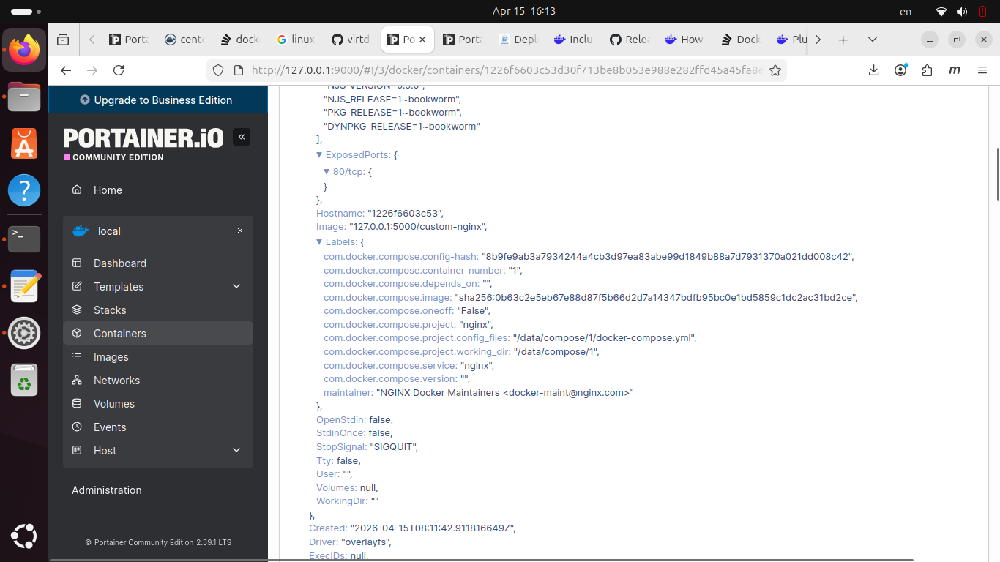
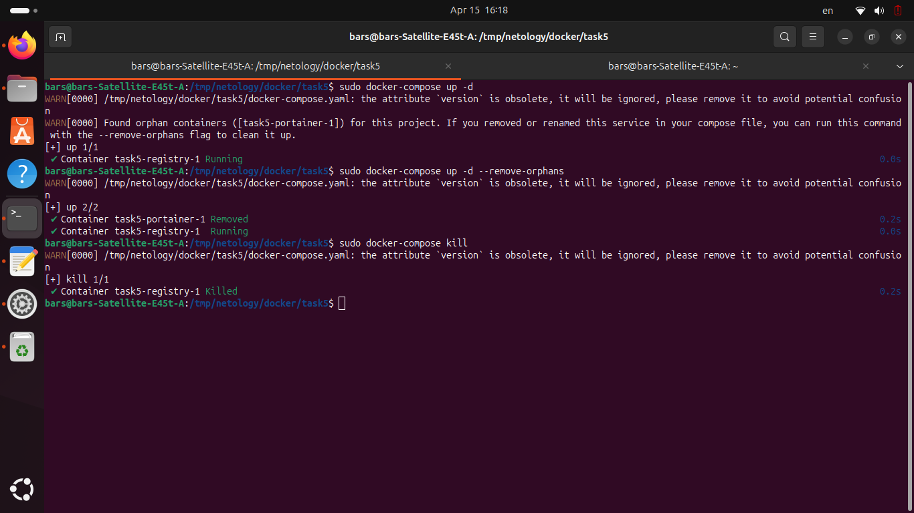
7.Среди контейнеров, зарегистрированных в Docker Compose были такие, на которые при запуске не было ссылок, было предложено от них избавиться.
