# Домашнее задание к занятию 5. «Практическое применение Docker»

### Ответы

## Задача 0
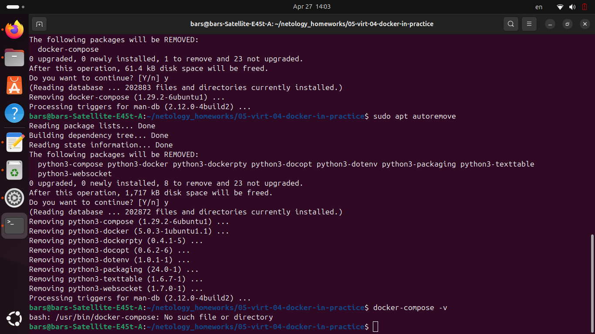

## Задача 1

2. 
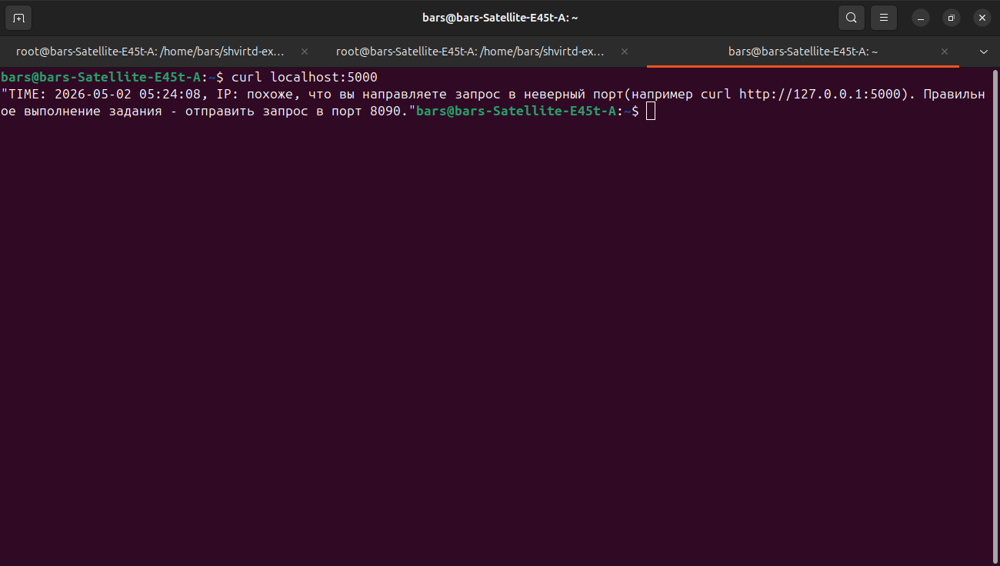
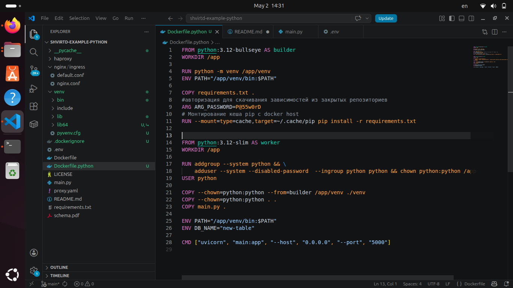
3. 
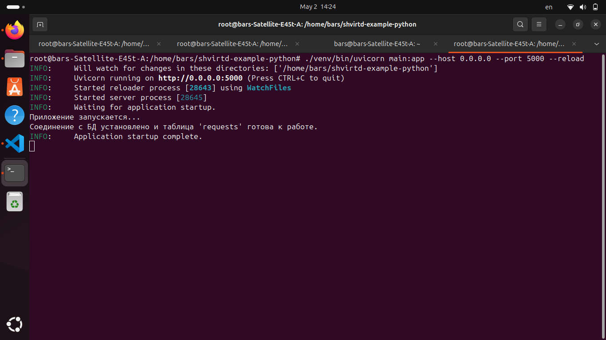
4. 
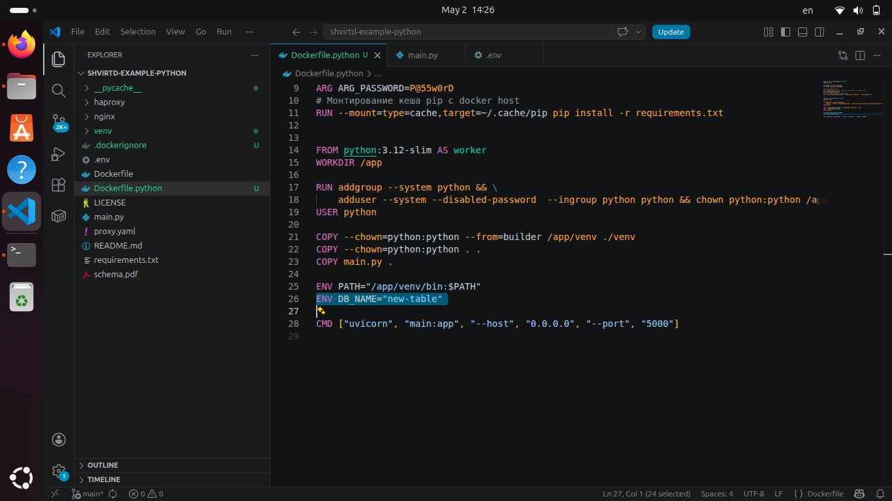

## Задача 2 (*)

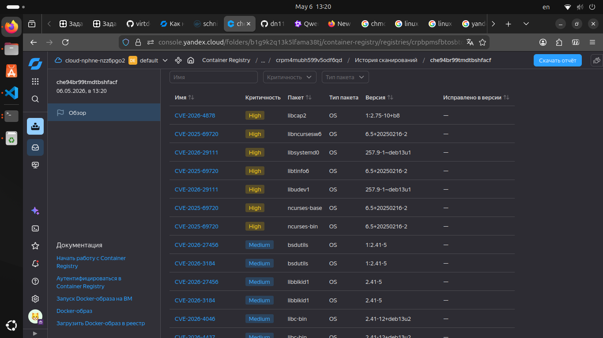

## Задача 3

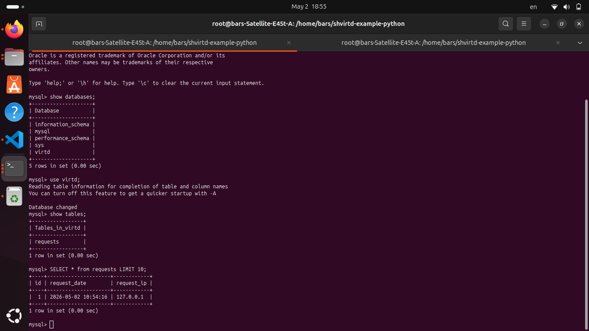

## Задача 4

https://github.com/dn113h-svg/shvirtd-example-python#
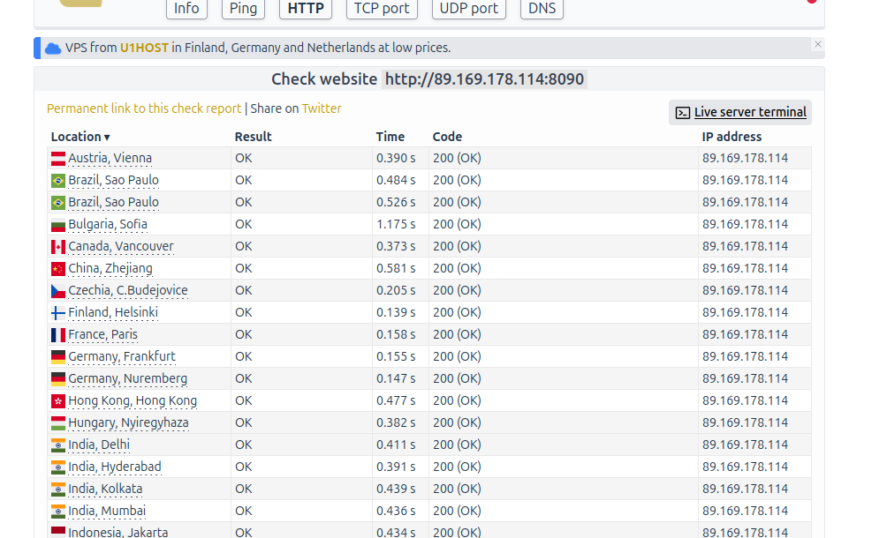
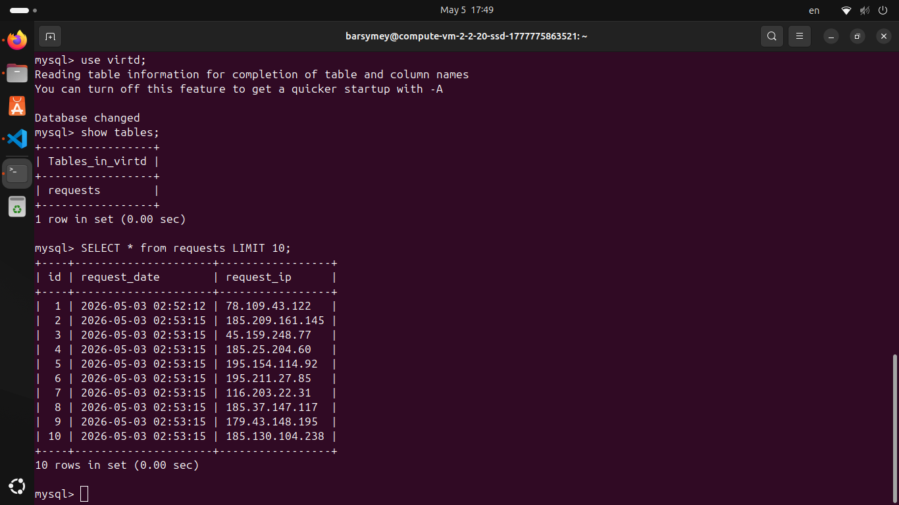
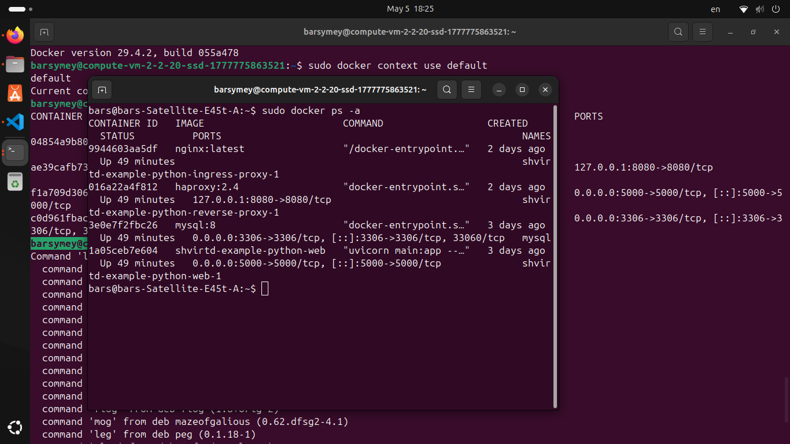

## Задача 5 (*)

https://github.com/dn113h-svg/shvirtd-example-python/blob/main/backup.sh
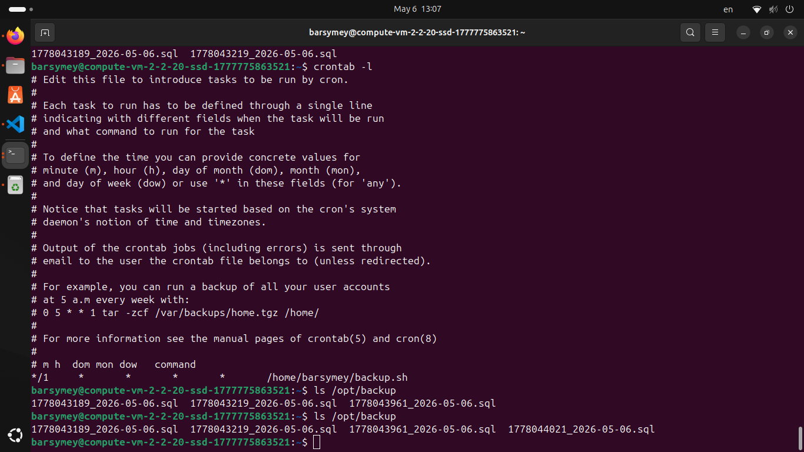

## Задача 6

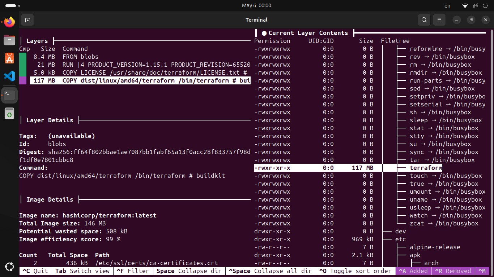
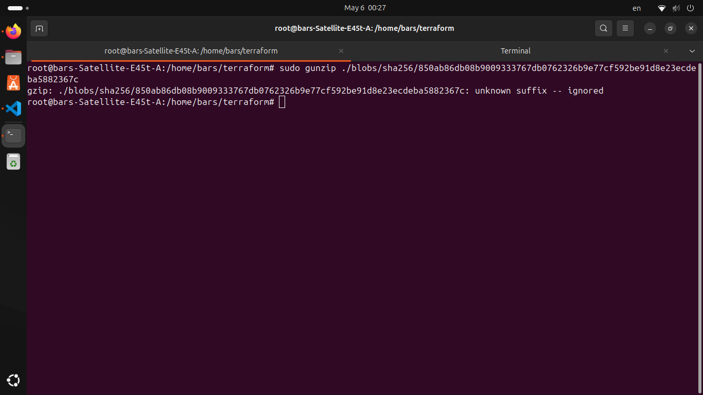
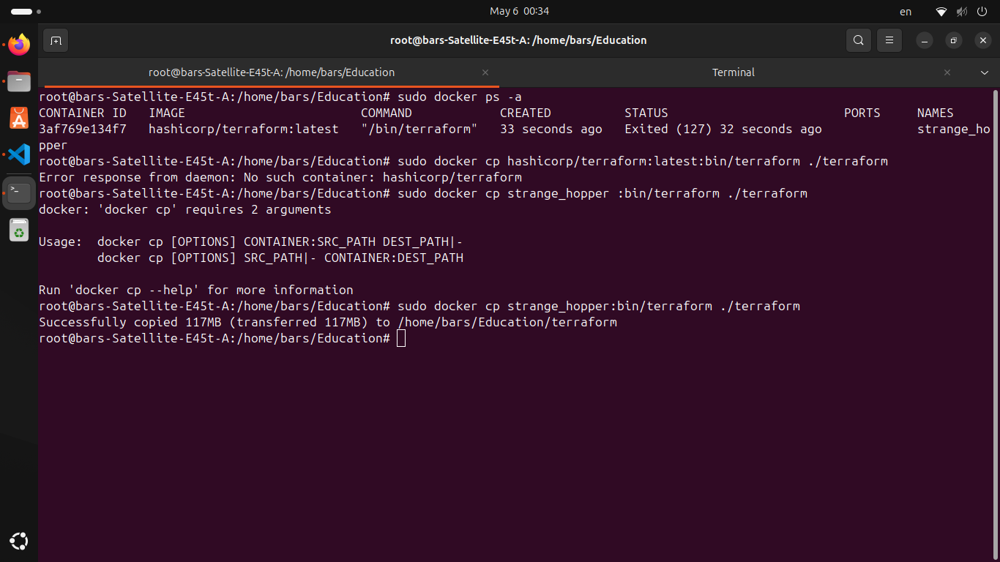