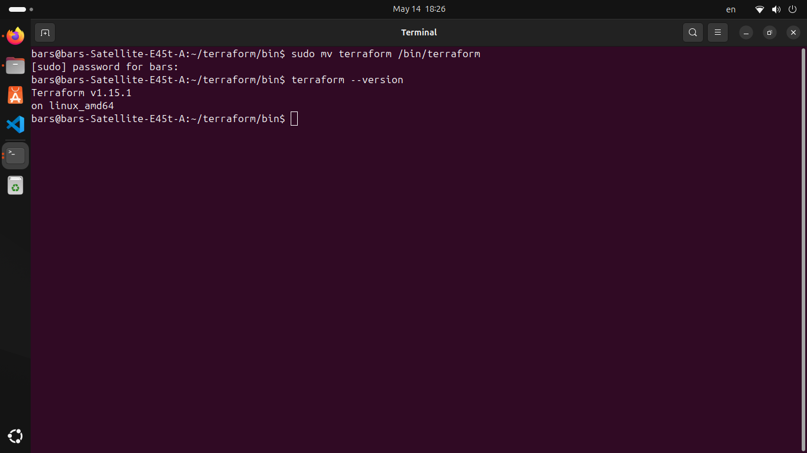
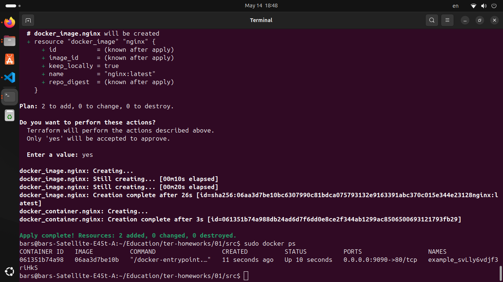
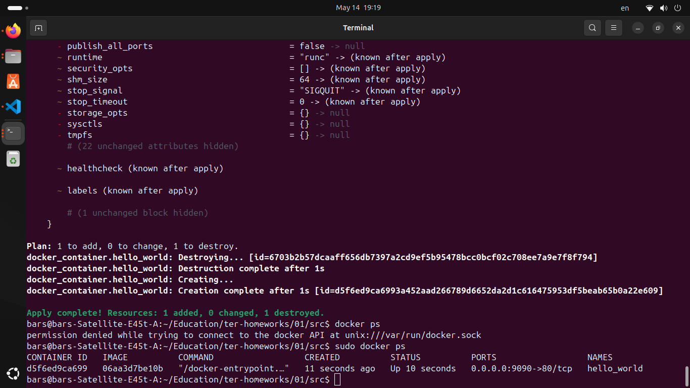
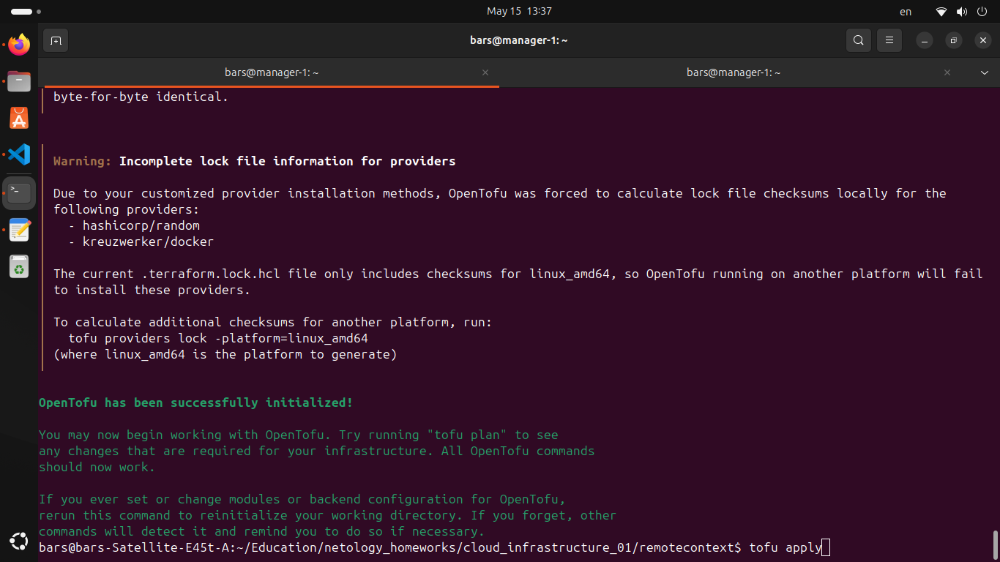
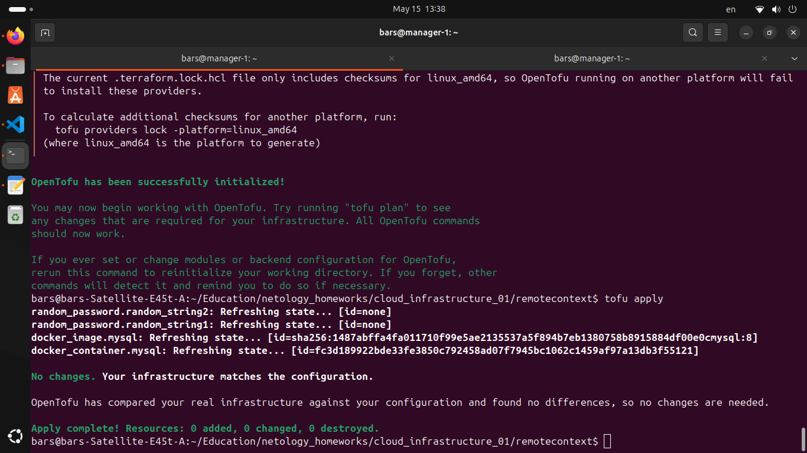

# Домашнее задание к занятию «Введение в Terraform»

### Ответы

## Задача 1
1. 
2. personal.auto.tfvars
3. "result": "svLly6vdjf3riHkS"
4. Не были переданы аргументы при создании ресурсов, искажены имена
5. 

6. Скорее всего, он пригодился бы при массовом применении проверенной конфигурации на облачных машинах.

7. 
8. Судя по всему, образ был скачан в докере, а тераформ не удаляет его образы.

## Задача 2

1. Код в директории ./remotecontext

## Задача 3

Зеркало добавлено через .tofurc

