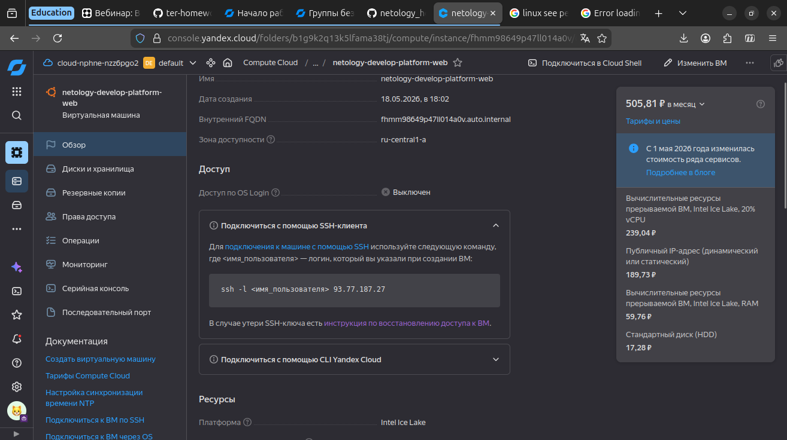
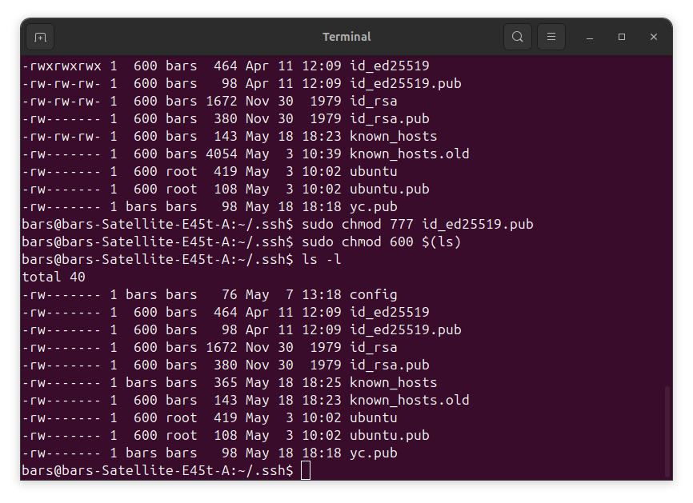
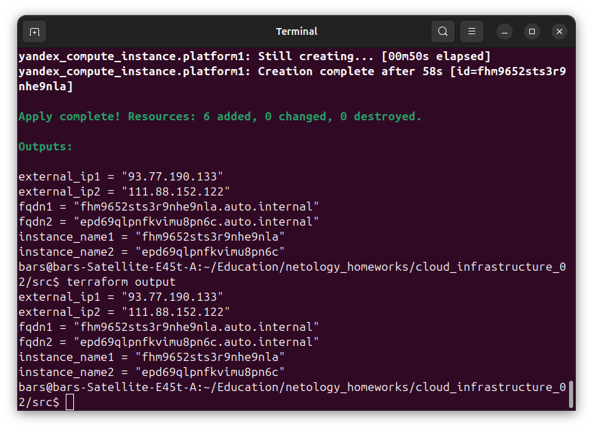
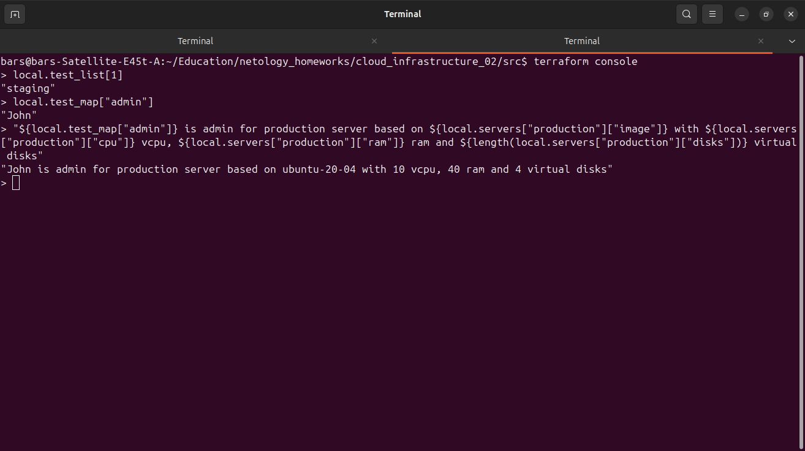
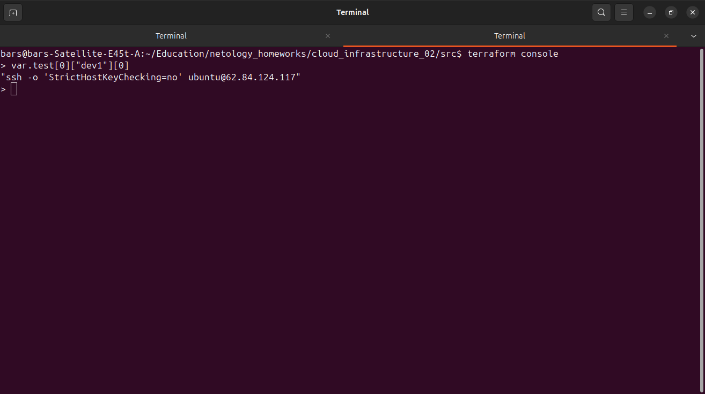

# Домашнее задание к занятию «Введение в Terraform»

### Ответы

## Задача 1
4. 
Среди допустимых значений paltform_id не было standart-v4, заменено на standard-v3. 
Доля ядра слишком мала, заменено на 20
Количество ядер выставлено на 2 вместо 1

5. 

6. 
preemptible = true сильно удешевит эксплуатацию вм и предотвратит расход гранта даже если вм не была выключена вручную.
core_fraction=5 уменьшит долю используемого ресурса процессора, чем снизит стоимость вм(хотя terraform отказался создавать вм менее чем с 20 процентами)

## Задача 4

## Задача 7

## Задача 8

